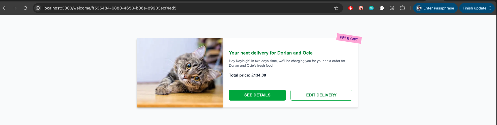
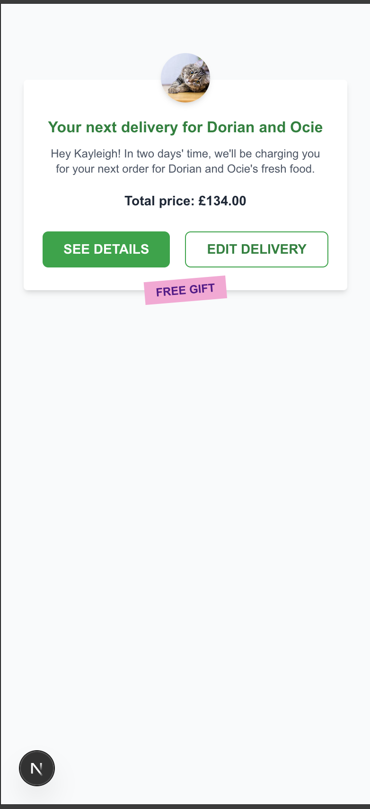

# Tech Stack

- Next.js (App Router + Server Components)
- Nest.js (Backed API service)
- TypeScript
- Tailwind CSS
- Jest + Testing Library
- Monorepo with Yarn Workspaces

# Frontend Rendering Strategy (Server-Side Rendering with Client Hydration)

This project uses [Next.js App Router](https://nextjs.org/docs/app/building-your-application/routing) and leverages **React Server Components** to optimize performance and reduce unnecessary client-side JavaScript. Below is a breakdown and justification for the rendering strategy used across the page and its components.

## Screenshot

Desktop

## 

Mobile

## 

---

## Component Overview

| Component      | Rendering Type | Reason                                                                   |
| -------------- | -------------- | ------------------------------------------------------------------------ |
| `WelcomePage`  | **Server**     | Handles data fetching and delivers a fully server-rendered HTML response |
| `DeliveryCard` | **Server**     | Static, Stateless, layout-only component                                 |
| `Button`       | **Client**     | Handles `onClick`, `hover`, and other browser-based interactions         |

---

## `WelcomePage` – Server Component

The `WelcomePage` component is implemented as a **Server Component** for the following reasons:

- **Data-driven**: It uses `fetchDeliveryData(userId)` to retrieve data on the server before rendering.
- **SSR performance**: The data is injected directly into the HTML response, enabling faster LCP (Largest Contentful Paint) and better SEO.
- **No internal state**: The page is simple and has no real state changes or updates.
- **Reduced bundle size**: Server-rendered components don’t need to be shipped as JavaScript to the browser.

---

## `DeliveryCard` – Server Component

The `DeliveryCard` component is implemented as a **Server Component** for the following reasons:

- **Presentational-only**: It is a purely visual component that receives fully resolved `DeliveryData` as props. It doesn’t fetch data or manage any business logic.
- **No interactivity**: It does not handle any client-side interactions directly — it simply renders the content it receives (e.g., title, message, total price, gift badge).
- **Hydration not required**: It doesn’t rely on browser APIs, state, or effects, so hydration is unnecessary.
- **Better performance**: Rendering this component on the server avoids shipping unnecessary JavaScript to the client, reducing the overall bundle size.
- **Component composition**: It uses other components like `GiftBanner` and `Button`, but only the `Button` is a client component — keeping the interactive boundary minimal and intentional.

---

## `Button` – Client Component

The `Button` component is implemented as a **Client Component** for the following reasons:

- **Interactivity**: Buttons inherently involve client-side behavior, such as responding to `onClick` events, triggering navigation, modals, or performing actions. Even if unused initially, interactivity is expected by design.
- **Browser APIs**: HTML button behavior (like form submission, focus states, etc.) requires access to the DOM, which only Client Components can handle.
- **Forward-thinking**: Marking it as a Client Component upfront makes it easier to add future interactivity (e.g. loading states, analytics, conditional UI) without refactoring.
- **Encapsulation**: Keeping interactivity isolated in a single, leaf-level component ensures that parent components like `DeliveryCard` can remain Server Components, maintaining optimal performance.

---

## Running the project

**This project is set up as a monorepo.**

From the root run:

```bash
yarn install
yarn dev
```

Open [Localhost on port 3000](http://localhost:3000/welcome/ff535484-6880-4653-b06e-89983ecf4ed5) with your browser to see the result.

---

## Running tests

You can choose to run all tests from the root if you like, or cd into each app (frontend or backend) and run the tests. Either way the script to run is.

```bash
yarn test
```

---

## Running lint

You can choose to run lint from the root if you like, or cd into each app (frontend or backend) and run lint. Either way the script to run is

```bash
yarn lint
```
